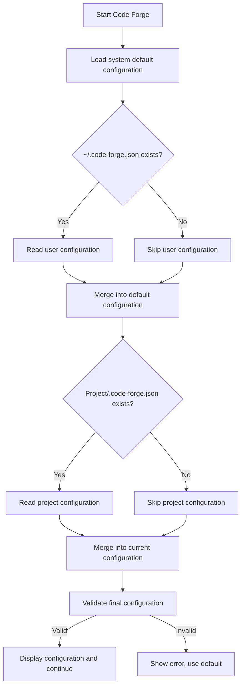

# Code Forge Configuration Hierarchy

## Configuration File Naming

### ✅ Use `.code-forge.json`

**Reasons:**
- Clearly identifies as Code Forge configuration
- Avoids conflicts with other tools
- Consistent with project name

### ❌ Do not use `.forge.json`

**Issues:**
- Too generic, may conflict with other tools
- Examples: Minecraft Forge, Laravel Forge, Electron Forge, etc.
- Unclear which tool the configuration belongs to

## Configuration Hierarchy

Code Forge supports **three-layer configuration** with priority from high to low:

```
1. Project configuration    Project root/.code-forge.json     [Highest priority]
2. User configuration      ~/.code-forge.json                 [Medium priority]
3. System default          Built-in defaults                  [Lowest priority]
```

### Configuration Merge Strategy

```
System default values
  ← Partially override ← ~/.code-forge.json (user global)
  ← Partially override ← project/.code-forge.json (project-specific)
```

**Merge rules:**
- Object fields: Deep merge
- Array fields: Complete replacement
- Basic types: Direct override

## Configuration File Locations

### 1. Project Configuration (Highest Priority)

**Location:** `project-root/.code-forge.json`

**Purpose:**
- Project-specific directory structure
- Team unified configuration
- Override user global configuration

**Example:**
```bash
your-project/
├── .code-forge.json    # Project configuration
├── planning/
├── src/
└── package.json
```

**Content example:**
```json
{
  "directories": {
    "base": "planning/"      // Project-specific directory
  },
  "git": {
    "commit_state_file": true  // Team needs to share status
  }
}
```

**When to use:**
- ✅ Team collaboration projects (unified configuration)
- ✅ Project has special directory structure
- ✅ Need to override personal habits

### 2. User Configuration (Global Default)

**Location:** `~/.code-forge.json`

**Purpose:**
- Personal preference settings
- Default configuration for all projects
- Can be overridden by project configuration

**Content example:**
```json
{
  "directories": {
    "base": "dev-plans/"     // Personal preferred directory name
  },
  "execution": {
    "auto_tdd": true,        // Personal TDD preference
    "default_mode": "ask"    // Personal habit of asking
  },
  "git": {
    "commit_state_file": false  // Personal preference not to commit status
  }
}
```

**When to use:**
- ✅ Set personal work habits
- ✅ Default behavior for all projects
- ✅ Avoid repeating configuration for each project

### 3. System Default (Built-in)

**Location:** Code Forge built-in

**Content:**
```json
{
  "directories": {
    "base": "",
    "input": "docs/features/",
    "output": "planning/"
  },
  "git": {
    "auto_commit": false,
    "commit_state_file": true,
    "gitignore_patterns": []
  },
  "execution": {
    "default_mode": "ask",
    "auto_tdd": true,
    "task_granularity": "medium"
  }
}
```

**When to use:**
- When no configuration files exist
- As the baseline default values

## Configuration Merge Examples

### Example 1: Basic Merge

**System default:**
```json
{
  "directories": {
    "base": "",
    "input": "docs/features/",
    "output": "planning/"
  }
}
```

**User configuration `~/.code-forge.json`:**
```json
{
  "directories": {
    "base": "dev-plans/"
  }
}
```

**Final result:**
```json
{
  "directories": {
    "base": "dev-plans/",           // User override
    "input": "docs/features/",     // Keep default
    "output": "planning/"           // Keep default
  }
}
```

### Example 2: Three-layer Merge

**System default:**
```json
{
  "directories": {"base": "", "input": "docs/features/", "output": "planning/"},
  "git": {"commit_state_file": true},
  "execution": {"default_mode": "ask"}
}
```

**User configuration `~/.code-forge.json`:**
```json
{
  "directories": {"base": "dev-plans/"},
  "git": {"commit_state_file": false}
}
```

**Project configuration `.code-forge.json`:**
```json
{
  "directories": {"base": "project-plans/"}
}
```

**Final result:**
```json
{
  "directories": {
    "base": "project-plans/"     // Project overrides user
  },
  "git": {
    "commit_state_file": false   // User overrides default
  },
  "execution": {
    "default_mode": "ask"        // Keep default
  }
}
```

### Example 3: Array Merge (Replacement)

**User configuration:**
```json
{
  "git": {
    "gitignore_patterns": ["**/state.json"]
  }
}
```

**Project configuration:**
```json
{
  "git": {
    "gitignore_patterns": ["planning/"]
  }
}
```

**Final result:**
```json
{
  "git": {
    "gitignore_patterns": ["planning/"]  // Complete replacement, not merge
  }
}
```

## Configuration Detection Flow



## Configuration Display on Startup

Code Forge displays the final configuration being used at startup:

```
📋 Code Forge Configuration
├── Base directory: planning/
├── Input directory: docs/features/
├── Output directory: planning/
├── Configuration sources:
│   ├── System default: ✓
│   ├── User configuration: ~/.code-forge.json ✓
│   └── Project configuration: .code-forge.json ✓
└── Final priority: Project configuration

Files will be created at...
Continue?
```

## Temporary Mode

Use `--tmp` to write plan files to `.code-forge/tmp/` instead of the configured output directory:

```bash
/code-forge:plan --tmp "Add user export feature"
/code-forge:plan --tmp @docs/features/user-auth.md
```

Plan files are auto-gitignored and cleaned up by `/code-forge:finish` after merge.

**Priority:**
```
--tmp flag > Project configuration > User configuration > System default
```

## Practical Scenarios

### Scenario 1: Individual Developer

**Setup:**
```bash
# Set personal global preferences
cat > ~/.code-forge.json <<'EOF'
{
  "directories": {
    "base": ".dev/"           // Personal preference for hidden directory
  },
  "git": {
    "commit_state_file": false  // Personal preference not to commit status
  }
}
EOF
```

**Effect:**
- All projects default to using `.dev/` directory
- All projects default not to commit state.json
- Specific projects can override with project configuration

### Scenario 2: Team Project

**Team agreement:**
```bash
# Project configuration (commit to Git)
cat > .code-forge.json <<'EOF'
{
  "directories": {
    "base": "planning/"
  },
  "git": {
    "commit_state_file": true   // Team shares status
  }
}
EOF

git add .code-forge.json
git commit -m "chore: add Code Forge configuration"
```

**Effect:**
- Team members automatically use unified configuration after clone
- Overrides individual's global configuration
- Ensures team consistency

### Scenario 3: Multi-Project Individual Development

**Project A (Web Application):**
```json
// .code-forge.json
{
  "directories": {
    "base": "docs/",
    "input": "specs/",
    "output": "implementation/"
  }
}
```

**Project B (Library Development):**
```json
// .code-forge.json
{
  "directories": {
    "base": "dev/",
    "input": "features/",
    "output": "plans/"
  }
}
```

**User Global (Default):**
```json
// ~/.code-forge.json
{
  "directories": {
    "base": "planning/"
  }
}
```

**Effect:**
- Different projects use different directory structures
- New projects automatically use global default
- Flexible adaptation to different project needs

## Configuration Validation

### Validation Rules

1. **Directory paths**
   - Cannot contain `..` (security consideration)
   - Cannot be absolute path (must be relative to project root)
   - Cannot be system directories (like `/usr/`, `/etc/`)

2. **Field types**
   - `directories.*` must be string
   - `git.commit_state_file` must be boolean
   - `execution.default_mode` must be "ask" | "manual" | "auto"

3. **Conflict detection**
   - `base` cannot be `src/`, `node_modules/`, `build/`, etc.

### Validation Error Handling

**When configuration is invalid:**
```
❌ Configuration validation failed

Errors:
  - directories.base cannot contain '..'
  - git.commit_state_file must be boolean

Will use system default configuration to continue
```

## Migration Guide

### Migrating from `.forge.json`

If you previously used `.forge.json`:

```bash
# Rename configuration file
mv .forge.json .code-forge.json

# Or global configuration
mv ~/.forge.json ~/.code-forge.json
```

Code Forge will auto-detect and prompt:
```
⚠️  Old configuration file .forge.json detected
Recommend renaming to .code-forge.json to avoid conflicts

Rename automatically?
  - Yes, rename
  - No, continue using
  - Cancel
```

## Best Practices

### ✅ Recommended

1. **Commit project configuration to Git**
   ```bash
   git add .code-forge.json
   ```
   - Unified team configuration
   - Out-of-the-box for new members

2. **Set user configuration for personal preferences**
   ```bash
   cat > ~/.code-forge.json <<'EOF'
   {"execution": {"auto_tdd": true}}
   EOF
   ```
   - Personalized workflow
   - Doesn't affect team configuration

3. **Minimize configuration**
   ```json
   {
     "directories": {
       "base": "planning/"  // Only configure necessary
     }
   }
   ```
   - Use defaults for others
   - Configuration is clearer

### ❌ Not Recommended

1. **Don't set project-specific paths in user configuration**
   ```json
   // ~/.code-forge.json
   {
     "directories": {
       "base": "my-specific-project-path/"  // ❌
     }
   }
   ```

2. **Don't ignore project configuration**
   ```bash
   echo ".code-forge.json" >> .gitignore  // ❌
   ```
   - Team configuration should be shared

## FAQ

### Q: How do I know which configuration is currently being used?

A: Code Forge displays the configuration source and final values on startup

### Q: Where should user configuration be placed?

A: `~/.code-forge.json` (user home directory)

### Q: Should project configuration be committed?

A: ✅ Recommended to commit for unified team configuration

### Q: How to avoid plan files polluting the project?

A: Use `--tmp` flag: `/code-forge:plan --tmp "requirement"`. Files go to `.code-forge/tmp/` (auto-gitignored).

### Q: What if configurations conflict?

A: Project configuration > User configuration > System default (high priority overrides low)

### Q: Will `.code-forge.json` conflict with other tools?

A: No, the name is specific enough, conflict probability is extremely low

## Summary

| Configuration | Location | Priority | Purpose |
|---------------|----------|----------|---------|
| Project configuration | `.code-forge.json` | 🥇 Highest | Team unified |
| User configuration | `~/.code-forge.json` | 🥈 Medium | Personal preference |
| System default | Built-in | 🥉 Lowest | Fallback default |

**Recommended practices:**
- Team projects: Commit `.code-forge.json`
- Personal preferences: Set `~/.code-forge.json`
- Special projects: Project configuration overrides global
