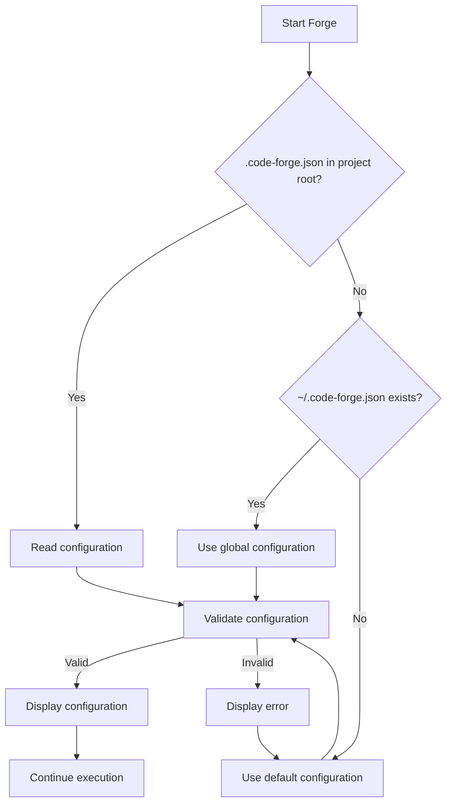

# Code Forge Directory Design Guide

## Design Philosophy

Code Forge separates **specification** (what to build) from **implementation planning** (how to build it):

- **Input** (`docs/features/`): Feature specs live alongside project documentation — owned by spec-forge
- **Output** (`planning/`): Implementation plans are language-specific working artifacts — owned by code-forge

This separation enables multi-language projects to share feature specs while maintaining independent implementation plans.

## Default Directory Structure (Recommended) ⭐⭐⭐

```
project/
├── docs/                  # Project documentation
│   ├── features/          # Input: feature specs (shared, language-agnostic)
│   │   ├── user-auth.md   # Generated by /spec-forge:feature
│   │   └── payments.md
│   ├── api/               # Existing project docs
│   └── guides/
│
├── planning/              # Output: implementation plans (language-specific)
│   ├── overview.md        # Project-level overview (auto-generated)
│   └── user-auth/         # Per-feature implementation plan
│       ├── overview.md
│       ├── plan.md
│       ├── tasks/
│       └── state.json
│
├── src/
└── tests/
```

**Advantages:**
- ✅ Feature specs in `docs/` — natural home for documentation
- ✅ Implementation plans in `planning/` — clear separation from docs
- ✅ Multi-repo friendly: shared feature specs, independent implementation plans
- ✅ No nested subdirectories (`planning/implementation/` is gone)
- ✅ Works with spec-forge out of the box

## Configuration

### Default Configuration

The default `.code-forge.json` uses this structure:

```json
{
  "directories": {
    "base": "",
    "input": "docs/features/",
    "output": "planning/"
  }
}
```

### Custom Configuration (Flexible)

Create `.code-forge.json` in the project root:

```json
{
  "directories": {
    "base": "",
    "input": "your-input-dir/",
    "output": "your-output-dir/"
  }
}
```

**When to use:**
- Have special directory structure requirements
- Team has unified standards
- Need to integrate with existing tools

## Configuration Examples

### Standard Project (Recommended)

```json
{
  "directories": {
    "base": "",
    "input": "docs/features/",
    "output": "planning/"
  }
}
```

### Multi-Repo Project (Shared Specs)

For projects where feature specs live in a separate repository:

```json
{
  "directories": {
    "base": "",
    "input": "../apcore/docs/features/",
    "output": "planning/"
  },
  "reference_docs": {
    "sources": ["../apcore/docs/**/*.md"]
  }
}
```

### Monorepo with Multiple Languages

```
monorepo/
├── docs/features/           # Shared feature specs
├── packages/
│   ├── python/
│   │   ├── planning/        # Python implementation plans
│   │   └── .code-forge.json # input: "../../docs/features/"
│   └── typescript/
│       ├── planning/        # TS implementation plans
│       └── .code-forge.json # input: "../../docs/features/"
```

### Personal Project (Minimal)

```json
{
  "directories": {
    "base": "",
    "input": "docs/features/",
    "output": "planning/"
  },
  "git": {
    "commit_state_file": false,
    "gitignore_patterns": ["**/state.json"]
  }
}
```

### Legacy: Keep All Under planning/

For backwards compatibility or if you prefer the old structure:

```json
{
  "directories": {
    "base": "planning/",
    "input": "features/",
    "output": ""
  }
}
```

Result:
```
planning/
├── features/          # Input
└── {feature}/         # Output (directly under planning/)
```

## Configuration Detection Flow



## spec-forge and code-forge Integration

The directory design supports a clean handoff between spec-forge and code-forge:

```
/spec-forge:feature user-auth      → docs/features/user-auth.md     (WHAT to build)
/code-forge:plan @docs/features/user-auth.md → planning/user-auth/  (HOW to build)
/code-forge:impl user-auth         → executes tasks                  (BUILD it)
```

For formal projects with the full spec-forge chain:

```
/spec-forge:spec-forge user-auth   → docs/user-auth/{prd,srs,tech-design,test-cases}.md  (full chain via orchestrator)
/spec-forge:feature user-auth      → docs/features/user-auth.md (extracted from tech-design)
/code-forge:plan @docs/features/user-auth.md → planning/user-auth/
```

## Migration Guide

### Migrating from planning/features/ + planning/implementation/

If you previously used the old directory structure:

```bash
# 1. Move feature docs to docs/features/
mkdir -p docs/features
mv planning/features/*.md docs/features/

# 2. Move implementation plans up one level
for dir in planning/implementation/*/; do
  feature=$(basename "$dir")
  mv "$dir" "planning/$feature"
done
rm -rf planning/implementation/
rm -rf planning/features/

# 3. Update configuration
cat > .code-forge.json <<'EOF'
{
  "directories": {
    "base": "",
    "input": "docs/features/",
    "output": "planning/"
  }
}
EOF

# 4. Commit
git add docs/features/ planning/ .code-forge.json
git commit -m "refactor: migrate to new code-forge directory structure"
```

### Migrating from deep-*

```bash
# 1. Create new directory structure
mkdir -p docs/features
mkdir -p planning

# 2. Move valuable documentation
cp 01-foundation/claude-plan.md planning/foundation/plan.md

# 3. Delete temporary files
rm -rf 01-foundation/sections/
rm -rf 01-foundation/reviews/
rm 01-foundation/claude-*.md

# 4. Create configuration
cat > .code-forge.json <<'EOF'
{
  "directories": {
    "base": "",
    "input": "docs/features/",
    "output": "planning/"
  }
}
EOF

# 5. Commit
git add docs/features/ planning/ .code-forge.json
git commit -m "docs: migrate to Code Forge structure"
```

## Git Workflow Recommendations

### Commit Strategy 1: Commit Everything (Team Collaboration)

```bash
# Commit
git add docs/features/ planning/
git commit -m "docs: add implementation plan for feature-x"
```

### Commit Strategy 2: Commit Plans Only (Personal Project)

```bash
# .gitignore
**/state.json

# Commit
git add docs/features/ planning/
git commit -m "docs: add implementation plan for feature-x"
```

### Commit Strategy 3: Ignore Planning (Private)

```bash
# .gitignore
planning/

# Only commit feature specs (shared documentation)
git add docs/features/
git commit -m "docs: add feature spec for feature-x"
```

## FAQ

### Q: What are the default directories?

A: `docs/features/` for input, `planning/` for output (if no configuration file exists)

### Q: How do I change the default directories?

A: Create `.code-forge.json`:
```json
{
  "directories": {
    "base": "",
    "input": "your-input/",
    "output": "your-output/"
  }
}
```

### Q: Should the configuration file be committed?

A: Yes, commit it so the team uses a unified directory structure.

### Q: How do I know which configuration is currently being used?

A: Code Forge displays it on startup:
```
Code Forge Configuration
  Input directory:  docs/features/
  Output directory: planning/
  Config source:    .code-forge.json (project)
```

### Q: Can I still use a single planning/ directory for everything?

A: Yes, use this configuration:
```json
{
  "directories": {
    "base": "planning/",
    "input": "features/",
    "output": ""
  }
}
```

## Best Practices

### Recommended

1. **Use the default structure** — `docs/features/` + `planning/`
2. **Commit the configuration file** — unified team structure
3. **Use spec-forge:feature to create feature specs** — consistent quality
4. **Choose an appropriate Git strategy** — team vs personal

### Not Recommended

1. **Don't use directory names with tool traces** — `.forge/`, `claude-dev/`, `ai-plans/`
2. **Don't use directories that may conflict** — `src/`, `node_modules/`, `build/`
3. **Don't change configuration frequently** — causes file dispersion

## Summary

| Component | Directory | Owner | Purpose |
|-----------|-----------|-------|---------|
| Feature specs | `docs/features/` | spec-forge | What to build (language-agnostic) |
| Implementation plans | `planning/` | code-forge | How to build (language-specific) |
| Formal specs | `docs/{feature}/` | spec-forge | PRD, SRS, Tech Design, Test Plan |
