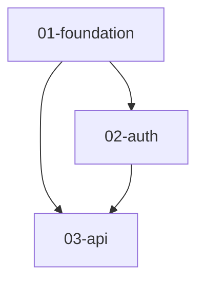

# Overview Guide

## What is overview.md?

`planning/overview.md` is a **project-level overview document** for:
- 📊 Display all modules and their relationships
- 🎯 Define implementation priority and sequence
- 📈 Track overall project progress
- 🤝 Coordinate multi-person team collaboration

## Why Is It Needed?

### Problem Scenarios

**Without overview.md:**
```
❌ Don't know what modules the project has
❌ Not clear about module dependencies
❌ Don't know what to do first
❌ Hard to grasp overall progress
❌ Team members work independently
```

**With overview.md:**
```
✅ See project overview at a glance
✅ Clear module dependencies
✅ Execute in recommended order
✅ Real-time overall progress tracking
✅ Coordinated team collaboration
```

## File Location

```
docs/
└── features/            # Feature documents for each module
    ├── module-a.md
    ├── module-b.md
    └── module-c.md

planning/                # Implementation plans for each module
├── overview.md          # Project-level overview (auto-generated)
├── module-a/
├── module-b/
└── module-c/
```

**Note:** The project-level `overview.md` lives inside the planning directory (alongside the feature subdirectories it describes) and is **auto-generated** by Code Forge whenever a feature plan is created, resumed, or completed.

## Core Content

### 1. Project Information
Basic project metadata:
- Project name, goals
- Technology stack
- Timeline
- Current status

### 2. Module Overview Table

```markdown
| Module | Description | Priority | Status | Progress | Owner |
|--------|-------------|----------|--------|----------|-------|
| 01-foundation | Infrastructure | P0 | ✅ Completed | 100% | - |
| 02-auth | Authentication | P0 | 🔄 In Progress | 60% | Alice |
| 03-api | API Service | P1 | ⏸️ Pending | 0% | - |
```

**Key information:**
- **Priority**: P0 (Must), P1 (Should), P2 (Nice)
- **Status**: ✅Completed 🔄In Progress ⏸️Pending 🚫Blocked
- **Progress**: Percentage or task count
- **Owner**: Current responsible team member

### 3. Dependency Graph (Mermaid)



**Purpose:**
- Visualize module dependencies
- Identify critical path
- Avoid circular dependencies

### 4. Recommended Implementation Order

```markdown
### Phase 1: Infrastructure
01-foundation
  └── Why first: Foundation for all modules

### Phase 2: Core Features
02-auth
  └── Why next: API requires authentication
```

**Includes:**
- Phased implementation plan
- Reason for each phase
- Completion criteria

### 5. Milestones

```markdown
### M1: Infrastructure Ready ✅ (Week 2)
- ✅ 01-foundation completed
- ✅ Development environment ready

### M2: MVP Release 🔄 (Week 6)
- 🔄 02-auth in progress
- ⏸️ 03-api pending
```

**Purpose:**
- Key point markers
- Progress milestones
- Team goals

### 6. Overall Progress

```
[>>>>>>>>>>>>>>>>                        ] 2/5 modules (40%)

Completed: 2/5 modules
In Progress: 1/5 modules
Pending: 2/5 modules
```

## When is it Created?

The project-level `overview.md` is **auto-generated** by Code Forge at these points:

| Trigger | When |
|---------|------|
| **New feature plan** | After `state.json` is initialized (Step 8.5) |
| **Dashboard view** | When `/code-forge:status` is run (Step 0.7) |
| **Feature completed** | After all tasks finish (Step 12) |

You do **not** need to create it manually. Code Forge scans all `state.json` files in the planning directory, analyzes feature dependencies, and generates the overview automatically.

### Manual Override

If you want to manually adjust the overview (e.g., reorder phases, add notes), you can edit it directly. The next auto-generation will overwrite your changes, so consider adding project-specific notes in a separate file if needed.

## How to Maintain?

### Update Frequency

| Update Scenario | Frequency | Responsible |
|-----------------|-----------|-------------|
| Module status change | Real-time | Module owner |
| Progress percentage | Weekly | Module owner |
| Overall summary | Weekly | Project owner |
| Dependency adjustment | As needed | Architect |

### Update Process

#### 1. When Module Completes

```markdown
# Update module status
| 01-foundation | ... | ✅ Completed | 100% | - |

# Update milestone
### M1: Infrastructure Ready ✅ (2025-02-15)
- ✅ 01-foundation completed

# Update progress
[>>>>>>>>                                ] 1/5 modules (20%)
Completed: 1/5 modules

# Add changelog
### 2025-02-15
- 01-foundation completed
- M1 milestone achieved
```

#### 2. When Module Starts

```markdown
# Update module status
| 02-auth | ... | 🔄 In Progress | 0% | Alice |

# Update next steps
### This Week
- [ ] Start 02-auth module
- [ ] Complete task 1: user model
```

#### 3. When Progress Changes

```markdown
# Update progress weekly
| 02-auth | ... | 🔄 In Progress | 45% | Alice |

# Update overall progress
[>>>>>>>>>>>>>>>>                        ] 2/5 modules (40%)
```

## Relationship with Module Planning

```
docs/
└── features/                        # Input documents
    └── module-a.md

planning/                            # Output
├── overview.md                      # Project overview (macro, auto-generated)
│   ├── List all modules
│   ├── Module relationships
│   ├── Overall progress
│   └── Implementation order
│
├── module-a/                        # Module details (micro)
│   ├── overview.md                  # Module overview + task execution order
│   ├── plan.md                      # Detailed plan
│   ├── tasks/                       # Task breakdown
│   └── state.json                   # Module status
│
└── module-b/
    └── ...
```

**Hierarchy:**
- **overview.md**: Project level, bird's-eye view
- **module/plan.md**: Module level, detailed plan
- **module/state.json**: Task level, execution status

## Team Collaboration

### Scenario 1: Parallel Multi-Person Development

**Alice handles authentication, Bob handles API:**

```markdown
# overview.md
| 02-auth | ... | 🔄 In Progress | 60% | Alice |
| 03-api  | ... | 🔄 In Progress | 30% | Bob |

## Team Assignment
| Alice | 02-auth | Task 3: JWT Implementation | 🔄 |
| Bob   | 03-api  | Task 1: Endpoint Design | 🔄 |
```

**Coordinate dependencies:**
- Bob waits for Alice to complete specific authentication interfaces
- Mark dependencies in overview.md
- Update progress weekly, sync status

### Scenario 2: New Team Member Joins

**New member Carol joins:**

1. **Read overview.md**
   - Understand project scope
   - Understand module relationships
   - See current progress

2. **Assign task**
   ```markdown
   | 04-deploy | ... | 🔄 In Progress | 0% | Carol |
   ```

3. **View detailed plan**
   - Read `planning/04-deploy/plan.md`
   - Start executing tasks

## Real Case: APCore Python

### Project Background
- 6 core modules
- Complex dependencies
- Multi-stage implementation

### Value of overview.md

**Problems:**
- ❌ Don't know whether to do registry or executor first
- ❌ Not clear what modules observability depends on
- ❌ Team members don't know overall progress

**Solution:**
```markdown
## Module Dependencies
foundation → schema → registry → executor → decorator
                 ↓        ↓        ↓         ↓
                 └────────┴────────┴─────────→ observability

## Recommended Order
1. foundation (base)
2. schema (depends on foundation)
3. registry + executor (can be parallel)
4. decorator (depends on executor)
5. observability (depends on all)

## Current Status
✅ foundation, schema completed
🔄 registry (75%), executor (40%) in progress
⏸️ decorator, observability pending
```

**Results:**
- ✅ Clear implementation path
- ✅ Reasonable parallel development
- ✅ Clear dependency waiting

## Best Practices

### ✅ Recommended

1. **Create at project start**
   - Plan first
   - Avoid later confusion

2. **Update regularly**
   - At least weekly
   - Immediate update on major changes

3. **Team consensus**
   - Review overview with team
   - Ensure understanding alignment

4. **Commit to Git**
   - Version control
   - History is traceable

### ❌ Not Recommended

1. **Create but never maintain**
   - Outdated documents are worse than none

2. **Too much detail**
   - overview is summary, not detailed design
   - Details go in module's plan.md

3. **Ignore dependencies**
   - Dependency graph is core value
   - Must be accurate

## Template Location

```bash
# Basic template
templates/overview.md

# Feature-level template
templates/feature-overview.md
```

## Summary

| Feature | Description | Value |
|---------|-------------|-------|
| **Project Overview** | All modules at once | Understand scope |
| **Dependencies** | Module relationship diagram | Plan order |
| **Implementation Order** | Recommended phases | Avoid rework |
| **Progress Tracking** | Overall progress visualization | Control pace |
| **Team Collaboration** | Assignment and status | Efficient collaboration |

**In one sentence: overview.md is the "battle map" for multi-module projects.**
