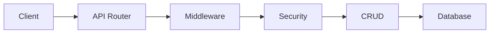
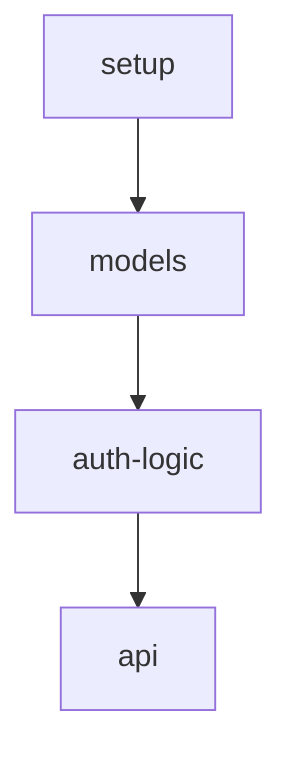

# User Authentication System Implementation Plan

## Goal

Implement a secure, testable JWT user authentication system that supports registration, login, and token refresh.

## Architecture

### Component Structure

```
src/auth/
├── models       # Data model (User)
├── schemas      # Request/response schemas
├── security     # Password hashing, JWT generation/validation
├── crud         # Database operations (CRUD)
├── middleware    # Authentication middleware (get_current_user)
└── routes       # API routes

tests/auth/
├── test_models
├── test_security
├── test_crud
└── test_api
```

### Data Flow



**Registration flow:**
1. Receive email and password
2. Validate email uniqueness
3. Hash password with bcrypt
4. Save to database
5. Return user info

**Login flow:**
1. Receive email and password
2. Query user
3. Verify password
4. Generate JWT token
5. Return token

**Token validation flow:**
1. Extract token from headers
2. Validate signature and expiration
3. Extract user ID
4. Return user object

### Technology Choices

- **Web Framework**
  - Rationale: routing, middleware, validation support
  - Choose based on team expertise and project needs

- **Relational Database + ORM**
  - Rationale: mature tooling, powerful querying
  - Advantages: type safety, migrations support

- **bcrypt (or equivalent)**
  - Rationale: industry-standard password hashing
  - Advantages: adaptive cost factor, rainbow-table resistant

- **JWT Library**
  - Rationale: standard token-based authentication
  - Advantages: stateless, scalable

- **Testing Framework**
  - Rationale: automated quality assurance
  - Advantages: regression prevention, refactor confidence

## Task Breakdown

### Overview



### Task List

#### Task: Project setup and dependencies
- **Files**: dependency manifest, test config, project structure
- **Estimated time**: 1-2 hours
- **Dependencies**: none
- **Acceptance**: dependencies installed, test runner works

#### Task: User models and database
- **Files**: models, schemas, database config
- **Estimated time**: 2-3 hours
- **Dependencies**: setup
- **Acceptance**: models defined, database connects, tests pass

#### Task: Authentication logic implementation
- **Files**: security module, CRUD operations, middleware
- **Estimated time**: 3-4 hours
- **Dependencies**: models
- **Acceptance**: password hashing, JWT generation/validation, CRUD tests pass

#### Task: API endpoints implementation
- **Files**: routes, app entry point
- **Estimated time**: 2-3 hours
- **Dependencies**: auth-logic
- **Acceptance**: all API endpoints implemented, integration tests pass

**Total estimated time**: 8-12 hours

## Risks and Considerations

### Technical Risks

1. **Password security**
  - Risk: bcrypt cost factor too low
  - Mitigation: use cost factor >= 12

2. **Token leakage**
  - Risk: token expiration not set reasonably
  - Mitigation: 24-hour expiry with refresh support

3. **SQL injection**
  - Risk: raw SQL string concatenation
  - Mitigation: use ORM and parameterized queries

### Performance Considerations

1. **Password hashing performance**
  - bcrypt is compute-intensive and may affect response time
  - Consider: async handling, caching strategy

2. **Database connections**
  - Use a connection pool to avoid frequent connection creation
  - Consider: pool size configuration

## Acceptance Criteria

### Functional
- [ ] Users can register successfully
- [ ] Users can log in with correct email and password
- [ ] Login returns a valid JWT token
- [ ] Protected endpoints are accessible with token
- [ ] Token can be refreshed
- [ ] Invalid credentials return appropriate errors

### Quality
- [ ] All unit tests pass
- [ ] Code coverage >= 80%
- [ ] No security issues (unencrypted passwords, SQL injection, etc.)
- [ ] Conforms to language style guide
- [ ] Key functions are documented

### Performance
- [ ] Login response time < 500ms
- [ ] Registration response time < 1s
- [ ] No errors at 100 concurrent requests

## References

- [JWT.io - JWT Introduction](https://jwt.io/introduction)
- [OWASP Authentication Cheat Sheet](https://cheatsheetseries.owasp.org/cheatsheets/Authentication_Cheat_Sheet.html)

## Extension Plan (Optional)

Future enhancements:
- Password reset (email verification)
- Email verification
- Two-factor authentication (2FA)
- Social login (Google, GitHub OAuth)
- User roles and permission management
- Token blacklist (logout)
