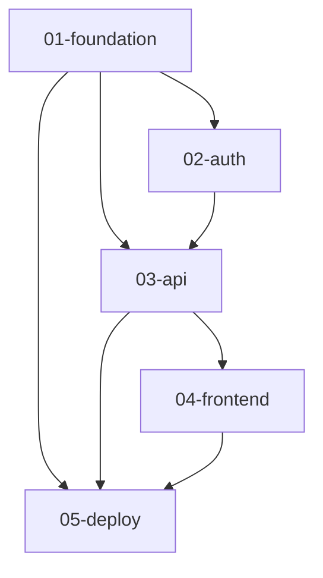

# Project Implementation Overview

> Overall project planning, module relationships, implementation order, and progress tracking

## Project Information

- **Project Name**: [Project Name]
- **Project Goal**: [One sentence describing what the project aims to achieve]
- **Technology Stack**: [Main technology stack]
- **Start Date**: [YYYY-MM-DD]
- **Expected Completion**: [YYYY-MM-DD]
- **Current Status**: 🟡 In Progress

## Overall Progress

```
[>>>>>>>>>>>>>>>>                        ] 2/5 modules (40%)

Completed: 2/5 modules
In Progress: 1/5 modules
Pending: 2/5 modules
```

## Module Overview

| Module | Description | Priority | Status | Progress | Owner |
|--------|-------------|----------|--------|----------|-------|
| [01-foundation](./foundation/) | Project Infrastructure | P0 | ✅ Completed | 100% | - |
| [02-auth](./auth/) | User Authentication System | P0 | ✅ Completed | 100% | - |
| [03-api](./api/) | RESTful API | P0 | 🔄 In Progress | 60% | - |
| [04-frontend](./frontend/) | Frontend Interface | P1 | ⏸️ Pending | 0% | - |
| [05-deploy](./deploy/) | Deployment Configuration | P2 | ⏸️ Pending | 0% | - |

**Priority Explanation:**
- **P0** - Must Have: Core functionality, must be completed
- **P1** - Should Have: Important functionality, should be completed
- **P2** - Nice to Have: Enhancement features, optional

**Status Explanation:**
- ✅ Completed - All tasks completed
- 🔄 In Progress - Currently implementing
- ⏸️ Pending - Not yet started
- 🚫 Blocked - Blocked by dependencies
- ⏭️ Skipped - Temporarily skipped

## Module Dependencies

### Dependency Graph



### Dependency Explanation

- **01-foundation** - No dependencies, base module
  - Provides project structure, configuration, utility functions

- **02-auth** - Depends on foundation
  - Uses foundation's database connection and configuration

- **03-api** - Depends on foundation, 02-auth
  - Uses authentication middleware from 02-auth
  - Uses foundation's utility functions

- **04-frontend** - Depends on api
  - Calls API endpoints

- **05-deploy** - Depends on foundation, api, frontend
  - Deploys all components

## Recommended Implementation Order

### Phase 1: Infrastructure (Week 1-2)

```
01-foundation
  ├── Task 1: Project Structure Setup
  ├── Task 2: Database Configuration
  ├── Task 3: Basic Utility Functions
  └── Task 4: Testing Framework Setup
```

**Why First:**
- Foundation for all other modules
- Provides development tools and configuration

**Completion Criteria:**
- [ ] Project can run
- [ ] Database connection successful
- [ ] Testing framework working

---

### Phase 2: Core Functionality (Week 3-4)

```
02-auth (depends on 01-foundation)
  ├── Task 1: User Model
  ├── Task 2: Authentication Logic
  ├── Task 3: JWT Implementation
  └── Task 4: API Endpoints
```

**Why Next:**
- API needs authentication functionality
- Core P0 functionality

**Completion Criteria:**
- [ ] Users can register
- [ ] Users can login
- [ ] Token validation working

---

### Phase 3: Business Logic (Week 5-6)

```
03-api (depends on 01-foundation, 02-auth)
  ├── Task 1: Core Business Models
  ├── Task 2: CRUD Endpoints
  ├── Task 3: Business Logic
  └── Task 4: API Documentation
```

**Why Next:**
- Frontend depends on API
- Main business value

**Completion Criteria:**
- [ ] All API endpoints implemented
- [ ] API documentation complete
- [ ] Integration tests passed

---

### Phase 4: User Interface (Week 7-8)

```
04-frontend (depends on 03-api)
  ├── Task 1: Page Framework
  ├── Task 2: Component Development
  ├── Task 3: API Integration
  └── Task 4: User Experience Optimization
```

**Why Now:**
- API already available
- Users can start using

**Completion Criteria:**
- [ ] All pages implemented
- [ ] API calls working
- [ ] Good user experience

---

### Phase 5: Deployment (Week 9)

```
05-deploy (depends on all modules)
  ├── Task 1: Docker Configuration
  ├── Task 2: CI/CD Setup
  ├── Task 3: Production Environment Configuration
  └── Task 4: Monitoring and Logging
```

**Why Last:**
- Needs all modules complete
- Final deployment step

**Completion Criteria:**
- [ ] Application can be deployed
- [ ] CI/CD automated
- [ ] Monitoring working

## Milestones

### M1: Infrastructure Ready (Week 2)
- ✅ 01-foundation complete
- ✅ Development environment available
- ✅ Testing framework ready

### M2: Core Functionality Complete (Week 4)
- ✅ 02-auth complete
- ✅ User authentication available

### M3: API Ready (Week 6)
- 🔄 03-api in progress
- ⏸️ API endpoints complete
- ⏸️ API documentation complete

### M4: MVP Release (Week 8)
- ⏸️ 04-frontend complete
- ⏸️ Basic features available
- ⏸️ Internal testing complete

### M5: Production Release (Week 9)
- ⏸️ 05-deploy complete
- ⏸️ Production environment live
- ⏸️ Monitoring ready

## Critical Path

```mermaid
gantt
    title Project Timeline
    dateFormat YYYY-MM-DD

    section Phase 1
    01-foundation    :done,    f1, 2025-02-01, 2w

    section Phase 2
    02-auth          :done,    f2, after f1, 2w

    section Phase 3
    03-api           :active,  f3, after f2, 2w

    section Phase 4
    04-frontend      :         f4, after f3, 2w

    section Phase 5
    05-deploy        :         f5, after f4, 1w

    section Milestones
    M1: Infrastructure Ready    :milestone, m1, after f1, 0d
    M2: Core Complete           :milestone, m2, after f2, 0d
    M3: API Ready               :milestone, m3, after f3, 0d
    M4: MVP Release             :milestone, m4, after f4, 0d
    M5: Production Release      :milestone, m5, after f5, 0d
```

## Risks and Dependencies

### Key Dependencies

1. **Technical Dependencies**
   - foundation → All modules depend on it
  - 02-auth → 03-api depends on it
   - api → frontend depends on it

2. **Resource Dependencies**
   - Database server (external)
   - Cloud service account (external)
   - Third-party APIs (if any)

### Potential Risks

| Risk | Impact | Probability | Mitigation |
|------|--------|-------------|------------|
| Database migration issues | High | Medium | Test migration scripts in advance |
| API performance insufficient | High | Low | Performance testing, caching strategy |
| Third-party service unavailable | Medium | Low | Fallback plan, retry mechanism |
| Team member changes | Medium | Medium | Complete documentation, knowledge sharing |

## Team Assignment

| Member | Responsible Modules | Current Task | Status |
|--------|-------------------|--------------|--------|
| Developer A | 01-foundation, 02-auth | - | ✅ Completed |
| Developer B | 03-api | Task 3: Business Logic | 🔄 In Progress |
| Developer C | 04-frontend | - | ⏸️ Pending Assignment |
| DevOps | 05-deploy | - | ⏸️ Pending Assignment |

## Progress Details

### Completed Modules

#### ✅ 01-foundation (100%)
- Completion Time: 2025-02-15
- Tasks: 4/4
- Commits: 12 commits
- [View Details](./foundation/)

#### ✅ 02-auth (100%)
- Completion Time: 2025-03-01
- Tasks: 4/4
- Commits: 15 commits
- [View Details](./auth/)

### In Progress Modules

#### 🔄 03-api (60%)
- Start Time: 2025-03-02
- Tasks: 3/5
- Remaining Tasks:
  - [ ] Task 4: API Documentation
  - [ ] Task 5: Performance Optimization
- [View Details](./api/)

### Pending Modules

#### ⏸️ 04-frontend (0%)
- Expected Start: 2025-03-16
- Blocked Reason: Waiting for 03-api completion
- [View Details](./frontend/)

#### ⏸️ 05-deploy (0%)
- Expected Start: 2025-03-30
- Blocked Reason: Waiting for all modules completion
- [View Details](./deploy/)

## Quality Metrics

### Test Coverage

| Module | Unit Tests | Integration Tests | Total Coverage | Target |
|--------|-----------|-------------------|----------------|--------|
| 01-foundation | 95% | - | 95% | ✅ >= 80% |
| 02-auth | 88% | 92% | 90% | ✅ >= 80% |
| 03-api | 75% | 60% | 68% | ⚠️ < 80% |
| 04-frontend | - | - | - | - |
| 05-deploy | - | - | - | - |

### Code Quality

| Module | Linting | Complexity | Tech Debt | Status |
|--------|---------|------------|-----------|--------|
| 01-foundation | ✅ 0 issues | Low | None | ✅ |
| 02-auth | ✅ 0 issues | Low | None | ✅ |
| 03-api | ⚠️ 3 warnings | Medium | 2 TODOs | ⚠️ |
| 04-frontend | - | - | - | - |
| 05-deploy | - | - | - | - |

## Documentation

### Module Documentation

- [01-foundation Implementation Plan](./foundation/plan.md)
- [02-auth Implementation Plan](./auth/plan.md)
- [03-api Implementation Plan](./api/plan.md)
- [04-frontend Implementation Plan](./frontend/plan.md)
- [05-deploy Implementation Plan](./deploy/plan.md)

### Architecture Documentation

- [System Architecture](../docs/architecture/system-design.md)
- [Database Design](../docs/architecture/database-schema.md)
- [API Documentation](../docs/api/)

## Change History

### 2025-03-05
- 03-api module implementation started
- Adjusted 04-frontend start time

### 2025-03-01
- 02-auth module completed
- M2 milestone achieved

### 2025-02-15
- 01-foundation module completed
- M1 milestone achieved
- Project kickoff

## Next Actions

### This Week (Week 6)
- [ ] Complete 03-api Task 4: API Documentation
- [ ] Complete 03-api Task 5: Performance Optimization
- [ ] Prepare 04-frontend environment

### Next Week (Week 7)
- [ ] Start 04-frontend module
- [ ] Conduct 03-api integration testing
- [ ] Update API documentation

### This Month
- [ ] Complete 03-api module
- [ ] Complete M3 milestone
- [ ] Start 04-frontend implementation

## Notes

- All modules developed using TDD approach
- Code review required after each module completion
- Security audit required for critical modules
- Performance testing required before deployment

---

**Last Updated**: 2025-03-05
**Updated By**: Team Lead
